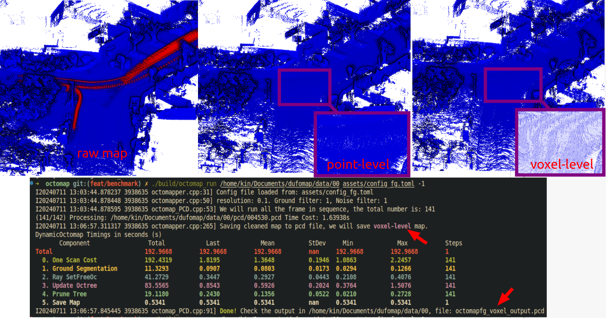

OctoMap
---

Reference: https://github.com/OctoMap/octomap_mapping when I write this codes.

No ros version!

pcd are enough to run this program. Need transformed and pose in VIEWPOINT. Please reference our dufomap benchmark for more detail.

TODO add DUFOmap benchmark link Here!!!

We will output all the scripts and dataset! Don't worry. We are working on it.
Message from [Qingwen ZHANG*](https://kin-zhang.github.io/) and [Daniel Duberg*](https://github.com/danielduberg)

## Install & Build

Test computer and System:

- Desktop setting: i9-12900KF, 64GB RAM, Swap 90GB, 1TB SSD
- System setting: Ubuntu 20.04
- Test Date: 2023/04/06
- Modified Version commit: https://github.com/Kin-Zhang/octomap/tree/92a9f14cafa5f567c47b58cbe91137c9a6ba1b0c

Dependencies:
### PCL


### glog gflag (only for debug)
glog gflag for debug only, will remove on release version
```sh
sh -c "$(wget -O- https://raw.githubusercontent.com/Kin-Zhang/Kin-Zhang/main/Dockerfiles/latest_glog_gflag.sh)"
```

### yaml-cpp
Please set the FLAG, check this issue if you want to know more: https://github.com/jbeder/yaml-cpp/issues/682, [TOOD inside the CMakeLists.txt](https://github.com/jbeder/yaml-cpp/issues/566)

If you install in Ubuntu 22.04, please check this commit: https://github.com/jbeder/yaml-cpp/commit/c86a9e424c5ee48e04e0412e9edf44f758e38fb9 which is the version could build in 22.04

```sh
cd ${Tmp_folder}
git clone https://github.com/jbeder/yaml-cpp.git && cd yaml-cpp
env CFLAGS='-fPIC' CXXFLAGS='-fPIC' cmake -Bbuild
cmake --build build --config Release
sudo cmake --build build --config Release --target install
```

## Run

Build
```bash
cd ${this_repo}
cmake -B build && cmake --build build
```

```bash
./octomap_run /home/kin/workspace/DUFOMap/data/KITTI_00 ../assets/config.yaml -1
```
- `-1` means all frames in the pcd folder, default is only 1 frame.

## Demo

Result with the default setting config in [assets/config.yaml](assets/config.yaml). Note we implement this one based on the octomapping and also this task like fit ground and set as static. So the `octomap` result is better than others' paper comparison table.



Octomap Timing:
```    
Octomap Timings:
         Component              Total   Last    Mean    StDev    Min     Max     Steps
        0. Fit ground           42.56   0.3509  0.3018  0.0681  0.1148  0.4551     141
        1. Ray SetFreeOc        208.67  1.5266  1.4799  0.1884  1.1213  1.9735     141
        2. Update Octree        125.70  1.0127  0.8915  0.2151  0.5576  1.6663     141
        3. Prune Tree           18.33   0.2292  0.1300  0.0470  0.0215  0.2292     141
        4. Query & Write         6.01   6.0091  6.0091    nan   6.0091  6.0091       1
```


**But DUFOMap is better** than octomap and fastest! please check our benchmark here [TODO](TODO)

DUFOMap Timing print in my desktop setting:
```bash
DUFOMap Timings
         Component      Total   Last    Mean    StDev    Min     Max     Steps
        0. Read          0.34   0.0022  0.0024  0.0007  0.0020  0.0079     141
        1. Integrate     8.79   0.0587  0.0624  0.0136  0.0472  0.1694     141
        2. Propagate     1.57   0.0107  0.0111  0.0033  0.0073  0.0320     141
        3. Clustering    0.23   0.2308  0.2308    nan   0.2308  0.2308       1
        4. Query         1.33   1.3294  1.3294    nan   1.3294  1.3294       1
        5. Write         8.23   8.2331  8.2331    nan   8.2331  8.2331       1
```